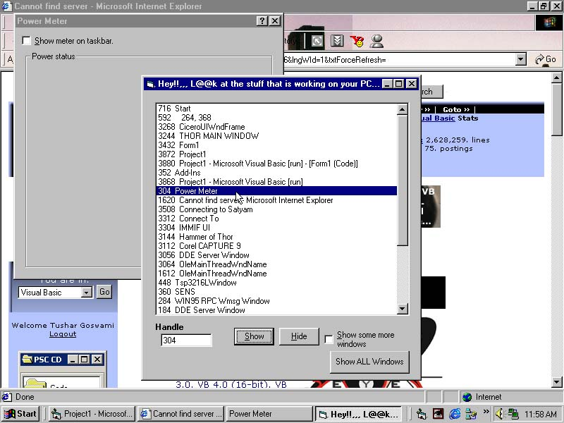



## Spying Taskbar by Tushar

### Description

This is an advanced Spying Taskbar by tushar:) This applications shows ALL the applications and processes working/running on your computer hidden. It ALSO Shows you ALL the applications that are NOT Visible through the Windows Taskbar. The user can also hide and unhide or view a selected window to see how it looks like on ur PC. This app is ideal for detecting hidden and suspicious viruses and trojans working on your PC. Even i fixed my "Lover's screensaver" trojan working on my pc through this program. You can ALSO add the functionality in this app to Find the EXE path of the selected app and terminate a selected process/application. This app also has the features such that You can view All the hidden forms of other opened applications and every part of of Desktop!. hope this application helps you ALL!:). The whole code is Commented too. Please vote and leave comments if this helps you in any way or your liked the app :D. - The API Man:)
 
### More Info
 

             |
---                |---
**Submitted On**   |2002-12-09 01:51:02
**By**             |[ThinkBase](https://github.com/Planet-Source-Code/PSCIndex/blob/master/ByAuthor/thinkbase.md)
**Level**          |Intermediate
**User Rating**    |4.3 (65 globes from 15 users)
**Compatibility**  |VB 3\.0, VB 4\.0 \(16\-bit\), VB 4\.0 \(32\-bit\), VB 5\.0, VB 6\.0
**Category**       |[Windows API Call/ Explanation](https://github.com/Planet-Source-Code/PSCIndex/blob/master/ByCategory/windows-api-call-explanation__1-39.md)
**World**          |[Visual Basic](https://github.com/Planet-Source-Code/PSCIndex/blob/master/ByWorld/visual-basic.md)
**Archive File**   |[Spying\_Tas1510261292002\.zip](https://github.com/Planet-Source-Code/thinkbase-spying-taskbar-by-tushar__1-41426/archive/master.zip)

